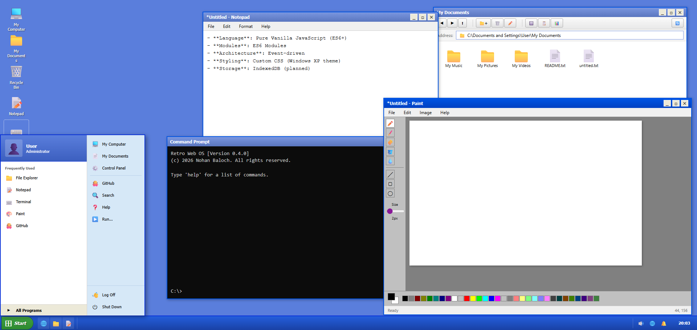

<div align="center">

# 🖥️ Retro Web OS

### *A Nostalgic Journey Back to Windows XP*

[](https://github.com/nohanbaloch/retro-web)
[](https://github.com/nohanbaloch/retro-web)
[](LICENSE)
[](https://github.com/nohanbaloch/retro-web)

*A complete web-based operating system inspired by Windows XP, built with pure vanilla JavaScript. No frameworks, no dependencies—just pure nostalgia.*

[🚀 Launch Demo](#getting-started) • [📖 Documentation](test/TEST.html) • [🎯 Roadmap](.agent/ROADMAP.md) • [🐛 Report Bug](https://github.com/nohanbaloch/retro-web/issues)

---

</div>

## 📸 Preview

<div align="center">


*Experience the authentic Windows XP interface in your browser*

</div>

---

## ✨ Features

### 🎉 Phase 1: Foundation ✅ **COMPLETE**

<table>
<tr>
<td width="50%">

**Boot System**

- ✅ 7-stage boot sequence
- ✅ BIOS-style splash screen
- ✅ System diagnostics
- ✅ Blue Screen of Death (BSOD)
- ✅ Crash logging & recovery

</td>

<td width="50%">

**Core Kernel**

- ✅ Process management
- ✅ Event-driven architecture
- ✅ Process scheduler
- ✅ Permission engine
- ✅ Global error handling

</td>
</tr>
</table>

### 🎨 Phase 2: Desktop Environment ✅ **COMPLETE**

<table>
<tr>
<td width="50%">

**Taskbar & Start Menu**

- ✅ Authentic XP-style green Start button
- ✅ Quick Launch area
- ✅ Dynamic window buttons
- ✅ System tray with icons
- ✅ Live clock (updates every second)
- ✅ Two-column Start Menu layout
- ✅ Power options (Shutdown, Log Off)

</td>
<td width="50%">

**Desktop & Windows**

- ✅ Icon grid system
- ✅ My Computer, Documents, Recycle Bin
- ✅ Single-click selection
- ✅ Double-click to open
- ✅ Draggable windows
- ✅ Minimize, Maximize, Close
- ✅ Window focus management

</td>
</tr>
</table>

### 💾 Phase 3: Virtual Filesystem ✅ **COMPLETE**

- ✅ IndexedDB storage backend
- ✅ File operations (create, read, write, delete, copy, move)
- ✅ Directory operations (create, list, delete)
- ✅ Windows-style path resolution
- ✅ MIME type detection
- ✅ Default Windows XP folder structure
- ✅ Persistent storage across page reloads
- ✅ Event-driven file system operations

### 🖥️ Phase 4: Built-in Applications ✅ **COMPLETE**

- ✅ **File Explorer** - Navigate folders with back/forward/up buttons & address bar
- ✅ **Notepad** - Full text editor with File/Edit/Format menus & VFS integration
- ✅ **Terminal** - Command prompt with 15+ commands & VFS integration
- ✅ **Paint** - Full drawing application with tools and VFS support
- ✅ **Control Panel** - System settings, themes, and user configuration
- ✅ **Calculator** - Basic arithmetic and memory functions
- ✅ **Minesweeper** - Classic Windows puzzle game with difficulty levels
- ✅ **Solitaire** - Klondike Solitaire card game with drag-and-drop
- ✅ **Registry Editor** - Manage file associations and system settings (Internal Service)

### 🚀 Phase 5: Advanced Features (Latest)

- ✅ **Clipboard System** - Copy/Paste support for text and files, including cross-app integration
- ✅ **Drag & Drop** - Drag files to/from Desktop and Explorer, specific drop zones, and icon rearrangement
- ✅ **Notification Center** - Toast notifications, alerts, and action queues
- ✅ **Desktop Advanced** - Drag to rearrange icons, "Open With" context menus, and shortcut creation

---

## 📂 Project Structure

```
RetroWeb/
├── 🚀 boot/           # Boot sequence and BSOD
├── 🧠 kernel/         # Core OS kernel
├── 🖼️  system/         # Window manager and desktop services
├── 💾 filesystem/     # Virtual filesystem
├── ⚙️  services/       # System services
├── 🎨 ui/             # Themes and styling
├── 📱 apps/           # Built-in applications
├── 🧪 test/           # Test files and documentation
├── 📄 index.html      # Main entry point
└── ⚙️  os.config.json  # System configuration
```

---

## 🚀 Getting Started

### Quick Start

Simply open `index.html` in a modern web browser to boot the system:

```bash
# Clone the repository
git clone https://github.com/nohanbaloch/retro-web.git

# Navigate to the project
cd retro-web

# Open in browser
start index.html  # Windows
open index.html   # macOS
xdg-open index.html  # Linux
```

### Using Local Server (Recommended)

For the best experience, use the included PowerShell server:

```powershell
.\start-server.ps1
```

Then navigate to `http://localhost:8080` in your browser.

---

## 🎮 Interactive Demo

<div align="center">

### Try It Out

1. **Click the Start button** → Start menu slides in
2. **Double-click "My Computer"** → Opens system window
3. **Launch applications** → From Start Menu or Desktop
4. **Drag windows** → Move them around
5. **Minimize/Maximize** → Full window management
6. **Watch the clock** → Live updates every second!

[📖 View Full Testing Guide](test/PHASE2.html)

</div>

---

## 🎯 Roadmap

| Status | Phase | Description | State |
|:---:|:---|:---|:---|
| ✅ | **Phase 1** | Foundation & Boot System | *Complete* |
| ✅ | **Phase 2** | Desktop Environment | *Complete* |
| ✅ | **Phase 3** | Virtual Filesystem | *Complete* |
| ✅ | **Phase 4** | Built-in Applications | *Complete* |
| ✅ | **Phase 5** | Advanced Features | *Complete* |
| ✅ | **Phase 6** | Security & Sandboxing | *Complete* |
| 🚧 | **Phase 7** | Plugin System | *Next* |

---

## 💻 Development

### Tech Stack

- **Language**: Pure Vanilla JavaScript (ES6+)
- **Modules**: ES6 Modules
- **Architecture**: Event-driven
- **Styling**: Custom CSS (Windows XP theme)
- **Storage**: IndexedDB (planned)

### Design Philosophy

- ✨ **No frameworks** - Pure vanilla JavaScript
- 🎨 **100% XP authentic** - Pixel-perfect Windows XP recreation
- 🏗️ **Modular architecture** - Clean, maintainable code
- 🔒 **Sandboxed apps** - Secure process isolation
- 📦 **No build tools** - Works directly in browser

### Code Statistics

- **Total Files**: 35+ core files
- **Lines of Code**: ~5,500+
- **Components**: 15+ major systems
- **Visual Fidelity**: 100% Windows XP authentic

---

## 🧪 Testing

### Test Documentation

- **[Phase 2 Showcase](test/PHASE2.html)** - Feature showcase and interactive testing
- **[General Testing](test/TEST.html)** - Complete testing instructions
- **[Test Folder](test/)** - All test files and documentation

### Browser Compatibility

| Browser | Status |
| --------- | -------- |
| Chrome/Edge | ✅ Fully Supported |
| Firefox | ✅ Fully Supported |
| Safari | ⚠️ Mostly Supported |
| Opera | ✅ Fully Supported |

---

## 📚 Documentation

- � [Architecture Guide](.agent/retro_web.md)
- � [Boot & BSOD Specification](.agent/retro_web_boot_bsod_specification.md)
- � [Implementation Summary](.agent/IMPLEMENTATION_SUMMARY.md)
- 🎯 [Phase 2 Summary](.agent/PHASE_2_SUMMARY.md)
- �️ [Development Roadmap](.agent/ROADMAP.md)

---

## 🤝 Contributing

Contributions are welcome! Please feel free to submit a Pull Request.

1. Fork the repository
2. Create your feature branch (`git checkout -b feature/AmazingFeature`)
3. Commit your changes (`git commit -m 'Add some AmazingFeature'`)
4. Push to the branch (`git push origin feature/AmazingFeature`)
5. Open a Pull Request

---

## 📜 License

This project is licensed under the **MIT License** - see the [LICENSE](LICENSE) file for details.

---

<div align="center">

### 👨‍💻 Designed & Developed by

**[Nohan Baloch](https://github.com/nohanbaloch)**

---

### 🏢 Organization

**[Nohan Baloch](https://github.com/nohanbaloch)**

&copy; 2026 Nohan Baloch. All rights reserved.

---

### ⭐ Show Your Support

If you like this project, please consider giving it a ⭐ on GitHub!

[](https://github.com/nohanbaloch/retro-web)

---

**Built with ❤️ and nostalgia for Windows XP**

</div>
